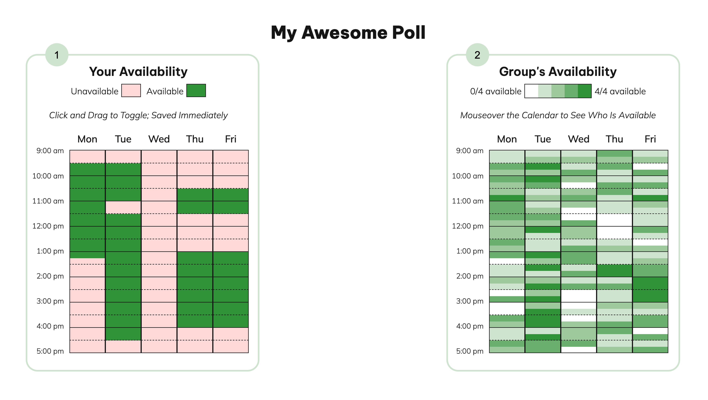
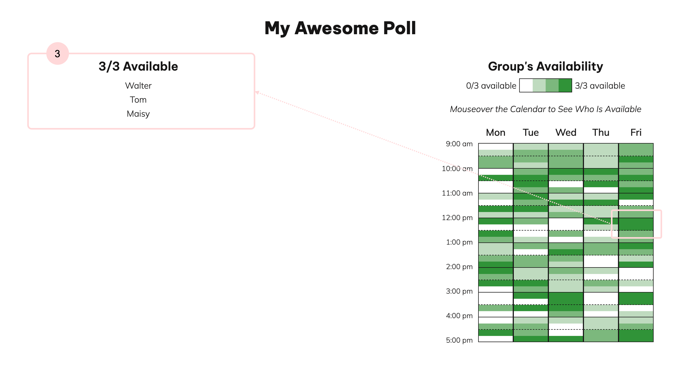

# when2meet
Simple implementation of when2meet for user testing: [https://catherinesyeh.github.io/when2meet/](https://catherinesyeh.github.io/when2meet/)

## instructions
Open [webpage](https://catherinesyeh.github.io/when2meet/) to start exploring. The app comes preloaded with the availabilities of three made up people.

*Try these features out!*
1. Input your availability by **clicking and dragging** the time blocks on the left side of the page
- This is a distinguishing features since on doodle, users click on time slots to indicate their availability 
- Additionally, you can only either be available or unavailable on when2meet (vs. "if need be" option on doodle)
- With this left grid, users can update their availability continuously and changes will be updated immediately, unlike doodle where you have to formally submit your availability and then press edit to make changes

2. **See the availability** of the other participants in a heatmap view on the right side of the page
- This is a distinguishing feature because on doodle, the availabilities of all the participants are displayed through an icon grid and the total counts for each timeslot are displayed at the top of each grid column

3. **Hover** over a timeslot on the group availability grid to see a list of who's available at that time
- This is a distinguishing feature because doodle doesn't have any sort of hover interaction and you can't really see who's available at a specific time, unless you visually check for yourself

*Click [here](https://github.com/catherinesyeh/doodle) to read more about when2meet and doodle's distinguishing features and see my **doodle** implementation.*

## future work
- *improve select mechanism:* currently, it has a bit of a lag (color changes don't show up as the user drags, but only afterwards) and the select doesn't quite have the same inversion property as the original when2meet (user can't immediately undo by "unselecting" same area)
- *more detailed hover view:* on the real when2meet, when you hover on a timeslot on the group grid, it shows you both who's available and unavailable at that time; right now, I only show the former
  - also, I'm not showing the date + time of the hovered timeslot right now, which the real when2meet does too
 - *hone color updates:* currently, the color legend (e.g., 0/x to x/x available) doesn't update entirely the same as the real when2meet
    - for example, if there is no time slot where x/x people are available, the darkest color should read x-1/x available, etc.
  
  ## other notes
  This UI was implemented from scratch, without using a tutorial. I did use the [SelectionArea](https://lucasmenendez.github.io/selection-area/) library to help implement when2meet's signature drag + click mechanism. I focused on the inputting availability aspects of both platforms, so I didn't incorporate differences in login, calendar syncing, etc.
